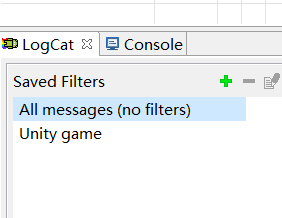

## 先决条件
### 1. 电脑上
* 下载adb（建议直接下Android Studio）
* 配置adb系统环境变量
    默认路径：`C:\Users\<user_name>\AppData\Local\Android\Sdk\platform-tools`
    
	[Reference Link](https://www.jianshu.com/p/494216e613eb)

### 2. 手机上
* 安卓手机进入开发者模式
    进入开发者模式：settings => about phone => build number (tap seven times)

## 使用
1. 数据线连接手机（如果之前没连过需要安装驱动）
2. 允许“USB调试”（应该有指引）
   
   [Reference Link](https://www.embarcadero.com/starthere/xe5/mobdevsetup/android/en/enabling_usb_debugging_on_an_android_device.html)
3. 电脑终端输入以下命令开始adb调试
    `adb logcat -s Unity ActivityManager PackageManager dalvikvm DEBUG`
    上一种指令在我(hyy)的电脑上不能过滤信息，导致有很多无用的信息，以下的指令可以只显示Unity debug消息
    `adb logcat -s Unity` （-s后加入想要过滤的filter log）
    
	[Reference Link](https://answers.unity.com/questions/492681/how-to-use-adb-logcat.html)

## 另一种直观的方式

[Reference Link](https://www.youtube.com/watch?v=eI2GOuEMGfQ)

1. 打开monitor.bat文件：路径: 'C:\Users\<user_name>\AppData\Local\Android\Sdk\tools'
2. 手机连接电脑(手机进入开发者模式)
3. 点击图中的绿色加号，在log处设置filter为Unity，在filter name处设置所需的filter的名字，点击确定
    

4. 点击刚刚设置的filter space，就能看见被过滤过的log消息（若filter log设置为Unity，则看到的log为Unity debug消息）
